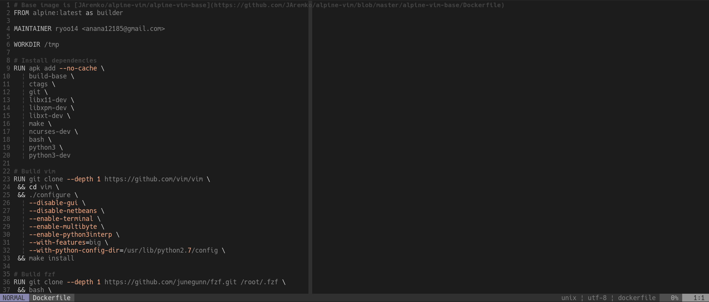

# coral.vim

coral.vim is vim colorscheme which is simple monotone with light coral highlights.

Only support terminal vim. Not support GUI.

Based on [mono_red](https://github.com/Michal-Miko/vim-mono-red).
